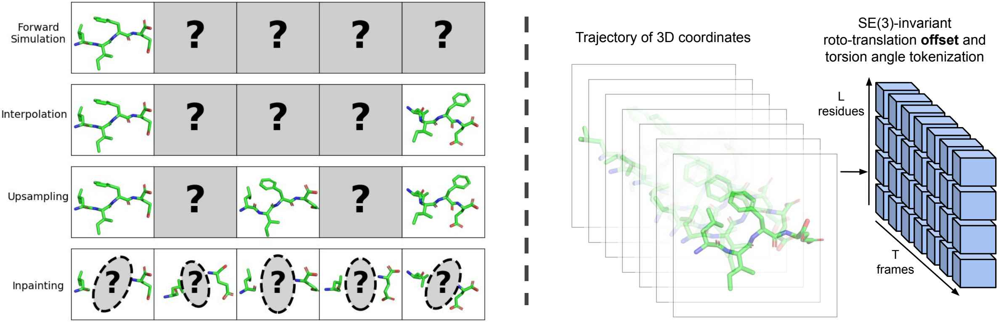

# MDGen

Implementation of [Generative Modeling of Molecular Dynamics Trajectories](https://arxiv.org/abs/2409.17808) by Bowen Jing*, Hannes Stark*, Tommi Jaakkola, and Bonnie Berger.

We introduce generative modeling of molecular trajectories as a paradigm for learning flexible multi-task surrogate models of MD from data. By conditioning on appropriately chosen frames of the trajectory, such generative models can be adapted to diverse tasks such as forward simulation, transition path sampling, and trajectory upsampling. By alternatively conditioning on part of the molecular system and inpainting the rest, we also demonstrate the first steps towards dynamics-conditioned molecular design. We validate these capabilities on tetrapeptide simulations and show initial steps towards learning trajectories of protein monomers. Methodological details and further evaluations can be found in the paper. Please feel free to reach out to us at bjing@mit.edu, hstark@mit.edu with any questions.

**Note:** This repository is provided for research reproducibility and is not intended for usage in application workflows.



## Installation

```
pip install numpy==1.21.2 pandas==1.5.3
pip install torch==1.12.1+cu113 -f https://download.pytorch.org/whl/torch_stable.html
pip install pytorch_lightning==2.0.4 mdtraj==1.9.9 biopython==1.79
pip install wandb dm-tree einops torchdiffeq fair-esm pyEMMA
pip install matplotlib==3.7.2 numpy==1.21.2
```

## Datasets

1. Download the tetrapeptide MD datasets:
```
mkdir -p data/4AA_sims data/4AA_sims_implicit
gsutil -m rsync -r gs://mdgen-public/4AA_sims data/4AA_sims
gsutil -m rsync -r gs://mdgen-public/4AA_sims_implicit data/4AA_sims_implicit
```
2. Download the ATLAS simulations via https://github.com/bjing2016/alphaflow/blob/master/scripts/download_atlas.sh to `data/atlas_sims`.
3. Preprocess the tetrapeptide simulations
```
# Forward simulation and TPS, prep with interval 100 * 100fs = 10ps
python -m scripts.prep_sims --splits splits/4AA.csv --sim_dir data/4AA_sims --outdir data/4AA_data --num_workers [N] --suffix _i100 --stride 100

# Upsampling, prep with interval 100fs
python -m scripts.prep_sims --splits splits/4AA_implicit.csv --sim_dir data/4AA_sims_implicit --outdir data/4AA_data_implicit --num_workers [N]

# Inpainting, prep with interval 100fs 
python -m scripts.prep_sims --splits splits/4AA.csv --sim_dir data/4AA_sims --outdir data/4AA_data --num_workers [N]
```
4. Preprocess the ATLAS simulations
```
# Prep with interval 40 * 10 ps = 400 ps
python -m scripts.prep_sims --splits splits/atlas.csv --sim_dir data/atlas_sims --outdir data/atlas_data --num_workers [N] --suffix _i40 --stride 40
```

## Training

Commands similar to these were used to train the models presented in the paper.
```
# Forward simulation
python train.py --sim_condition --train_split splits/4AA_train.csv --val_split splits/4AA_val.csv --data_dir data/4AA_data/ --num_frames 1000 --prepend_ipa --abs_pos_emb --crop 4 --ckpt_freq 40 --val_repeat 25 --suffix _i100 --epochs 10000 --wandb --run_name [NAME]

# Interpolation / TPS
python train.py --tps_condition --train_split splits/4AA_train.csv --val_split splits/4AA_val.csv --data_dir data/4AA_data/ --num_frames 100 --prepend_ipa --abs_pos_emb --crop 4 --ckpt_freq 40 --val_repeat 25 --suffix _i100 --epochs 10000 --wandb --run_name [NAME]

# Upsampling
python train.py --sim_condition --train_split splits/4AA_implicit_train.csv --val_split splits/4AA_implicit_val.csv --data_dir data/4AA_data_implicit/ --num_frames 1000 --prepend_ipa --abs_pos_emb --crop 4 --ckpt_freq 20 --val_repeat 25 --cond_interval 100 --batch_size 8 --epochs 10000 --wandb --run_name [NAME]

# Inpainting / design
python train.py --inpainting --train_split splits/4AA_train.csv --val_split splits/4AA_val.csv --data_dir data/4AA_data --num_frames 100 --prepend_ipa --abs_pos_emb --crop 4 --ckpt_freq 100 --val_repeat 25 --batch_size 32 --design --sampling_method euler --epochs 10000 --frame_interval 10 --no_aa_emb --no_torsion --wandb --run_name [NAME]

# ATLAS
python train.py --sim_condition --train_split splits/atlas_train.csv --val_split splits/atlas_val.csv --data_dir share/data_atlas/ --num_frames 250 --batch_size 1 --prepend_ipa --crop 256 --val_repeat 25 --epochs 10000 --atlas --ckpt_freq 10 --suffix _i40 --wandb --run_name [NAME]
```

## Model weights

The model weights used in the paper may be downloaded here:
```
wget https://storage.googleapis.com/mdgen-public/weights/forward_sim.ckpt
wget https://storage.googleapis.com/mdgen-public/weights/interpolation.ckpt
wget https://storage.googleapis.com/mdgen-public/weights/upsampling.ckpt
wget https://storage.googleapis.com/mdgen-public/weights/inpainting.ckpt
wget https://storage.googleapis.com/mdgen-public/weights/atlas.ckpt
```

## Inference

Commands similar to these were used to obtain the samples analyzed in the paper.
```
# Forward simulation
python sim_inference.py --sim_ckpt forward_sim.ckpt --data_dir share/4AA_sims --split splits/4AA_test.csv --num_rollouts 10 --num_frames 1000 --xtc --out_dir [DIR]

# Interpolation / TPS
python tps_inference.py --sim_ckpt interpolation.ckpt --data_dir share/4AA_sims --split splits/4AA_test.csv --num_frames 100 --suffix _i100 --mddir data/4AA_sims  --out_dir /data/cb/scratch/share/results/0506_tps_1ns 

# Upsampling 
python upsampling_inference.py --ckpt upsampling.ckpt --split splits/4AA_implicit_test.csv --out_dir outpdb/0505_100ps_upsampling_3139 --batch_size 10 --xtc --out_dir [DIR]

# Inpainting / design for high flux transitions
python design_inference.py --sim_ckpt inpainting.ckpt --split splits/4AA_test.csv --data_dir data/4AA_data/ --num_frames 100 --mddir data/4AA_sims --random_start_idx --out_dir [DIR] 

# Inpainting / design for random transitions
python design_inference.py --sim_ckpt inpainting.ckpt --split splits/4AA_test.csv --data_dir data/4AA_data/ --num_frames 100 --mddir data/4AA_sims --out_dir [DIR] 

# ATLAS forward simulation # note no --xtc here!
python sim_inference.py --sim_ckpt atlas.ckpt --data_dir share/data_atlas/ --num_frames 250 --num_rollouts 1 --split splits/atlas_test.csv --suffix _R1 --out_dir [DIR]
```

## Analysis

We run analysis scripts that produce a pickle file in each sample directory.
```
# Forward simulation
python -m scripts.analyze_peptide_sim --mddir data/4AA_sims --pdbdir [DIR] --plot --save --num_workers 1

# Interpolation / TPS
python -m scripts.analyze_peptide_tps --mddir data/4AA_sims --data_dir data/4AA_sims  --pdbdir [DIR] --plot --save --num_workers 1 --outdir [DIR]

# Upsampling
python -m scripts.analyze_upsampling --mddir data/4AA_sims_implicit --pdbdir [DIR] --plot --save --num_workers 1

# Inpainting / design
python -m scripts.analyze_peptide_design --mddir data/4AA_sims --data_dir data/4AA_data --pdbdir [DIR]
```
To analyze the ATLAS rollouts, follow the instructions at https://github.com/bjing2016/alphaflow?tab=readme-ov-file#Evaluation-scripts.

Tables and figures in the paper are extracted from these pickle files.

## License

MIT. Additional licenses may apply for third-party source code noted in file headers.

## Citation
```
@misc{jing2024generativemodelingmoleculardynamics,
      title={Generative Modeling of Molecular Dynamics Trajectories}, 
      author={Bowen Jing and Hannes Stärk and Tommi Jaakkola and Bonnie Berger},
      year={2024},
      eprint={2409.17808},
      archivePrefix={arXiv},
      primaryClass={q-bio.BM},
      url={https://arxiv.org/abs/2409.17808}, 
}
```
